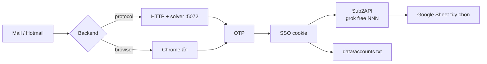

# grok-tool

<p align="center">
  <strong>Modular Grok / xAI registration pipeline</strong><br/>
  Browser · Protocol HTTP · Temp mail · Sub2API · Google Sheets · Web UI
</p>

<p align="center">
  
  
  
  
</p>

Đăng ký tài khoản Grok / xAI theo lô: lấy mail + OTP, vượt Turnstile, bắt SSO, rồi đẩy vào **Sub2API** (`grok free 001`, group `grok free`). Có UI web, CLI, và đường HTTP ẩn (~30s) không cần Chrome signup.

> **Secrets stay on your machine.** Copy `grok_tool/config.example.json` → `grok_tool/config.json`. Never commit `config.json`, account lists, or Chrome profiles. See [SAFE_GITHUB.md](grok_tool/SAFE_GITHUB.md).

---

## Mục lục

- [Tính năng](#tính-năng)
- [Cách hoạt động](#cách-hoạt-động)
- [Cài đặt](#cài-đặt)
- [Cách dùng nhanh](#cách-dùng-nhanh)
- [Ba backend](#ba-backend)
- [CLI](#cli)
- [Web UI](#web-ui)
- [Turnstile solver](#turnstile-solver)
- [Cấu hình](#cấu-hình)
- [Kết quả & dừng job](#kết-quả--dừng-job)
- [Cấu trúc repo](#cấu-trúc-repo)
- [FAQ / lỗi thường gặp](#faq--lỗi-thường-gặp)
- [Bảo mật](#bảo-mật)
- [Disclaimer](#disclaimer)

Chi tiết: [Usage](grok_tool/docs/USAGE.md) · [Config](grok_tool/docs/CONFIG.md) · [Architecture](grok_tool/ARCHITECTURE.md)

---

## Tính năng

| | |
|---|---|
| **Hai đường reg** | Chrome (pydoll, ẩn khỏi màn hình) hoặc protocol HTTP thuần (~30s) |
| **Mail linh hoạt** | Temp smart (azpop ↔ tmail failover), Hotmail list, Mail.tm |
| **OTP tự lấy** | Poll inbox, parse mã, điền form / gRPC |
| **Turnstile** | Solver local Camoufox `:5072` — không cướp cửa sổ |
| **Sub2API** | SSO → `POST /api/v1/admin/grok/sso-to-oauth`, tên `grok free NNN` |
| **Google Sheet** | Tùy chọn, Apps Script webapp — tắt mặc định |
| **Web control plane** | Aurora UI tại `http://127.0.0.1:8787` |
| **Dừng an toàn** | `ESC` · `Ctrl+C` · file `data/STOP` · nút Stop trên web |
| **Không lộ secret** | `.gitignore` chặn config, acc, cookie, Chrome profile |

---

## Cách hoạt động



1. Tạo / lấy email (temp smart hoặc Hotmail trong `data/hotmails.txt`).
2. Đăng ký Grok bằng **protocol** (nhanh) hoặc **browser** (ổn định hơn).
3. Đọc OTP, hoàn tất signup, bắt cookie SSO.
4. Import Sub2API với prefix `grok free` + số tăng dần.
5. Ghi ledger local. Sheet chỉ chạy nếu bạn bật trong config.

---

## Cài đặt

**Yêu cầu:** Python 3.11+, Chrome (nếu dùng backend browser), Windows khuyến nghị.

```bash
git clone https://github.com/nguyenquan27122005-cmd/grok-tool-.git
cd grok-tool-/grok_tool

python -m venv venv

# Windows
venv\Scripts\pip install -r requirements.txt
copy config.example.json config.json

# Linux / WSL
venv/bin/pip install -r requirements.txt
cp config.example.json config.json
```

Mở `config.json` và sửa **của bạn** (không commit file này):

```json
{
  "fixed_password": "CHANGE_ME_strong_password",
  "sub2api": {
    "enabled": true,
    "sub2api_url": "http://localhost:8080",
    "sub2api_user": "YOUR_SUB2API_EMAIL",
    "sub2api_pass": "YOUR_SUB2API_PASSWORD",
    "name_prefix": "grok free",
    "group": "grok free"
  }
}
```

Windows còn có `start.bat` (tạo venv + chọn mail + chạy).

---

## Cách dùng nhanh

### 1) Web UI (dễ nhất)

```bat
CHAY_WEB.bat
```

Mở [http://127.0.0.1:8787](http://127.0.0.1:8787)

| Field | Ý nghĩa |
|--------|---------|
| Loại email | `0` temp smart · `1` Hotmail · `2` azpop · `3` tmail |
| Số lượng | `1` một acc · `0` chạy tới khi Stop |
| Cách reg | `HTTP ẩn` (protocol) · `Chrome ẩn` · `auto` |
| Auto Sub2API | import SSO sau khi reg OK |
| Ẩn Chrome | cửa sổ ra ngoài màn hình, không nhảy focus |

Giữ cửa sổ CMD web **mở**. Bấm Stop trên UI hoặc `ESC` ở process reg.

### 2) CLI — một tài khoản

```bash
# Protocol HTTP (~30s) — cần solver :5072
venv\Scripts\python.exe main.py 0 --count 1 --backend protocol

# Chrome ẩn (không cần solver, ~2–3 phút)
venv\Scripts\python.exe main.py 0 --count 1 --backend browser
```

`0` = temp smart. Đổi `1` nếu dùng Hotmail.

### 3) Solver (bắt buộc cho protocol)

Mở **CMD thứ hai**:

```bat
CHAY_SOLVER.bat
```

Đợi `http://127.0.0.1:5072` lên, rồi mới bấm reg HTTP. Để cửa sổ solver mở.

---

## Ba backend

| Backend | Flag | Tốc độ | Cần gì | Khi nào dùng |
|---------|------|--------|--------|----------------|
| **protocol** | `--backend protocol` | ~30s | Solver `:5072` | Mặc định trên web, nhanh, ít Chrome |
| **browser** | `--backend browser` | ~2–3 phút | Chrome | Protocol fail / muốn UI flow |
| **auto** | `--backend auto` | tùy | Solver + Chrome | Thử HTTP, fail thì fallback Chrome |

Web mặc định **protocol**. CLI không truyền `--backend` thì đọc `reg_backend` trong config (mặc định browser).

---

## CLI

```text
python main.py [CHOICE] [--count N] [--backend MODE] [--provider NAME]
```

| Tham số | Giá trị |
|---------|---------|
| `CHOICE` | `0` auto_temp · `1` hotmail · `2` azpopmail · `3` tmail_wibu |
| `--count`, `-n` | Số acc. `0` = chạy mãi đến ESC / STOP |
| `--backend`, `-b` | `browser` · `protocol` · `auto` |
| `--provider`, `-p` | Giống CHOICE, dạng tên (`hotmail`, `auto_temp`, …) |

Ví dụ:

```bash
# 5 acc Hotmail, Chrome
python main.py 1 --count 5 --backend browser

# Chạy liên tục temp mail, protocol
python main.py 0 --count 0 --backend protocol

# Menu Python (màu + phím)
CHAY_REG.bat
```

`ESC` trong cửa sổ đang chạy = dừng ngay (kể cả giữa acc).

---

## Web UI

```bash
venv\Scripts\python.exe -m web_console.app
# hoặc nền / tự restart:
venv\Scripts\python.exe -m web_console.daemon
```

- **Đăng ký** — form job
- **Kết quả** — đọc `data/accounts.txt`
- **Logs** — theo dõi live
- **Cài đặt** — xem config đã set chưa (không hiện password)
- **Tools** — chỗ gắn tool khác sau này

Chỉ bind `127.0.0.1` — không expose ra mạng.

---

## Turnstile solver

Protocol path gọi solver local (Camoufox headless):

```bat
CHAY_SOLVER.bat
```

Lần đầu sẽ `pip install camoufox quart patchright` và `camoufox fetch`.  
Cửa sổ solver **không** hiện Chrome ra giữa màn hình.

Config:

```json
"turnstile": {
  "mode": "auto",
  "solver_url": "http://127.0.0.1:5072",
  "timeout_sec": 90
}
```

---

## Cấu hình

File thật: `grok_tool/config.json` (gitignored).  
Mẫu: [`config.example.json`](grok_tool/config.example.json).  
Giải thích từng key: [`docs/CONFIG.md`](grok_tool/docs/CONFIG.md).

| Nhóm | Key quan trọng |
|------|----------------|
| Mật khẩu Grok | `fixed_password` |
| Mail | `email_provider`, `temp_mail_order`, `hotmail_list` |
| Sub2API | `sub2api.enabled`, `sub2api_url`, user/pass, `name_prefix`, `group` |
| Solver | `turnstile.solver_url` |
| Chrome | `chrome_window_mode` (`lygaz` = ẩn), `chrome_debug_port` |
| Sheet | `google_sheets.enabled` — để `false` nếu không dùng |
| Nhịp | `batch_count`, `inter_success_delay_min/max` |

---

## Kết quả & dừng job

Ledger local (không push GitHub):

```text
email@example.com|password|added_sub2api:grok free 012
```

| Status | Nghĩa |
|--------|--------|
| `added_sub2api:grok free NNN` | Reg + import Sub2API OK |
| `success` | Reg OK, chưa/không import |
| `success_sub2api…` | Reg OK, Sub2API lỗi (queue retry) |
| `error…` / `otp_timeout` | Fail — xem log |

**Dừng:**

| Cách | Khi nào |
|------|---------|
| `ESC` | Cửa sổ CLI đang reg |
| `Ctrl+C` | Terminal |
| Nút Stop | Web UI |
| Tạo file `grok_tool/data/STOP` | Mọi backend |

---

## Cấu trúc repo

```text
grok-tool-/
├── README.md                 ← trang này
├── LICENSE
└── grok_tool/
    ├── main.py               # CLI entry
    ├── config.example.json
    ├── CHAY_WEB.bat          # UI :8787
    ├── CHAY_SOLVER.bat       # Turnstile :5072
    ├── CHAY_REG.bat          # menu terminal
    ├── grokreg/              # package chính
    │   ├── protocol/         # HTTP backend
    │   ├── browser/          # Chrome / CF
    │   ├── mail/             # OTP + temp mail
    │   ├── delivery/         # Sub2API + sheets
    │   └── cli/
    ├── web_console/          # FastAPI Aurora UI
    ├── services/turnstile_solver/
    └── docs/                 # USAGE + CONFIG
```

Runtime (`data/`, `chrome_profile*`, `config.json`) **không** nằm trên GitHub.

---

## FAQ / lỗi thường gặp

<details>
<summary><strong>Protocol chết ngay / timeout Turnstile</strong></summary>

Solver chưa chạy. Mở `CHAY_SOLVER.bat`, đợi port `5072`, chạy lại `--backend protocol`.
</details>

<details>
<summary><strong>Vẫn thấy cửa sổ Chrome</strong></summary>

1. Solver lần đầu fetch browser — để yên cho xong.  
2. Web: tick **Ẩn Chrome**.  
3. Config: `"chrome_window_mode": "lygaz"`.  
4. Browser backend vẫn launch Chrome, nhưng off-screen — không phải popup signup nếu dùng protocol.
</details>

<details>
<summary><strong>Sub2API không thấy acc</strong></summary>

- `sub2api.enabled: true` và URL/user/pass đúng.  
- Acc phải có status `added_sub2api:…`.  
- Tên mặc định: `grok free 001`, group `grok free`.  
- Sub2API phải đang listen (`localhost:8080` trong example).
</details>

<details>
<summary><strong>Hotmail không nhận OTP</strong></summary>

Đưa list vào `data/hotmails.txt` (một dòng `email|password` hoặc format tool đang dùng). Chạy `main.py 1`. Temp smart (`0`) không cần file này.
</details>

<details>
<summary><strong>Lỡ commit config / acc</strong></summary>

Coi secret đã lộ. Đổi password + token + quyền sheet. Xóa repo hoặc rewrite history — xóa commit mới **không** đủ. Đọc [SAFE_GITHUB.md](grok_tool/SAFE_GITHUB.md).
</details>

---

## Bảo mật

| Được đẩy GitHub | Chỉ ở máy bạn |
|-----------------|---------------|
| Source `.py`, UI, `.bat` | `config.json` |
| `config.example.json` | `data/accounts.txt`, `hotmails.txt` |
| Docs, `.gitignore` | Chrome profile, cookies, SSO |
| | `*service_account*.json`, `.env` |

Trước khi push:

```bat
CHECK_BEFORE_PUSH.bat
```

---

## Disclaimer

Dùng với trách nhiệm của bạn. Tôn trọng điều khoản xAI / Grok và các dịch vụ mail / API liên quan. Repo cung cấp **source + hướng dẫn local** — không phát acc, không chứa dữ liệu cá nhân.

## License

[MIT](LICENSE)
